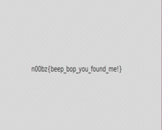

# BeepBop

By using a spectrogram viewer such as Sonic Visualiser, the participant notices signals on high frequencies. 
Google image of spectrogram. This observation prompts the participant to try to decode the audio using an SSTV tool.

To decode the audio file, the participant uses an SSTV tool from GitHub https://github.com/colaclanth/sstv

```
$ sstvd chall.wav -o result.png
```

open "result.png" and you can see the flag


