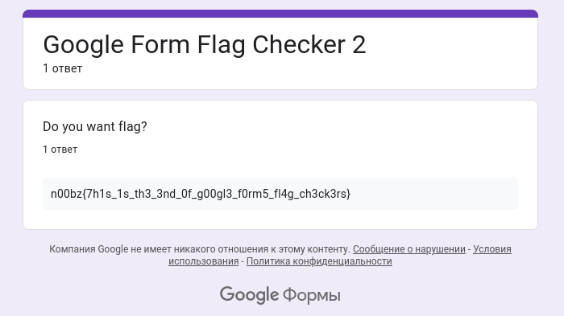

# Google Form 2


If you look closely, you can see that task description contains hint:

```
What's a good challenge without a second part?
Anyways make sure to VisIt thE neW link because
it has been updated PREVIOUSly because I had
too many RESPONSES. Author: NoobMaster
```

Сapital letters forms such phrase:

```
VIEW PREVIOUS RESPONSES
```

After some simple searches, you can find out that the previous answers are at this url:

https://docs.google.com/forms/d/e/FORMID/viewanalytics

Go to [url](https://docs.google.com/forms/d/e/1FAIpQLSd9-GMq2s_HTEE0Wv3UL2sNo3DSg1UBpyacOmoCZYuEymBAxw/viewanalytics) and get flag!



